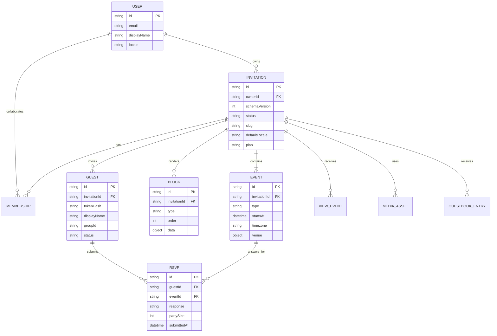

# Davetiye Veri Modeli v2

## Amaç

v2 modeli; tek dosyadaki düz `alici/baslik/mesaj` yapısını sürümlü, blok tabanlı ve çok etkinlikli bir ürüne taşır. Web, iOS, Android ve backend aynı sözleşmeyi kullanır. Şema: [`schemas/invitation-v2.schema.json`](../schemas/invitation-v2.schema.json).

## Varlık ilişkileri



## Saklama modeli

Firestore önerilen koleksiyonları:

```text
users/{userId}
invitations/{invitationId}
invitations/{invitationId}/events/{eventId}
invitations/{invitationId}/blocks/{blockId}
invitations/{invitationId}/guests/{guestId}
invitations/{invitationId}/guests/{guestId}/rsvps/{rsvpId}
invitations/{invitationId}/views/{viewId}
invitations/{invitationId}/guestbook/{entryId}
media/{assetId}
```

Küçük davetiyelerde `events` ve `blocks` yayın belgesine gömülebilir. Yönetim paneli için normalize alt koleksiyonlar, davetli render'ı için CDN/cache üzerinde tek bir **published snapshot** üretilir. Böylece okuma maliyeti ve tutarsız çoklu sorgular azaltılır.

## Temel kurallar

- Her belge `schemaVersion: 2` taşır.
- Zamanlar ISO-8601 UTC, etkinlik gösterimi IANA `timezone` ile yapılır.
- Kullanıcı metinleri `{ "tr": "…", "en": "…" }` biçiminde locale haritasıdır.
- Bloklar `order` ile sıralanır; bilinmeyen blok tipi istemciyi çökertmeden atlanır.
- Blok `data` yapısı tip bazlı uygulama sözleşmesiyle doğrulanır; üst şema ileriye uyumluluk için taşıyıcıdır.
- Yayındaki davetiye değişmez snapshot olarak okunur; düzenleme taslakta yapılır, yayın atomik değiştirilir.
- Davetli token'ının yalnız hash'i saklanır. Ham token URL'de bulunur ve loglara yazılmaz.
- E-posta/telefon yalnız bildirim gerçekten kullanılacaksa saklanır; veri minimizasyonu varsayılandır.

## Blok sözleşmesi

| Tip | Temel veri | Üreten issue |
|---|---|---|
| `cover` | isimler, zarf stili, açılış metni | #23 |
| `hero` | görsel asset, odak noktası, alt metin | #24 |
| `text` | başlık, gövde | Studio |
| `details` | etiket/değer satırları | Studio |
| `countdown` | eventId, bitti metni | Studio |
| `timeline` | eventId listesi, ikonlar | #26 |
| `map` | venue, harita sağlayıcıları | #25 |
| `gallery` | asset listesi, düzen | #24 |
| `music` | asset/track, autoplay=false | #27 |
| `menu` | gruplar ve öğeler | Studio |
| `gift` | tür, açıklama, maskeli değer/link | #28 |
| `rsvp` | alan ayarları, son tarih | #29 |
| `guestbook` | moderasyon ayarı | #38 |
| `livestream` | sağlayıcı, URL, yayın zamanı | #48 |
| `signature`, `seal`, `notes` | mevcut motor alanları | Studio |

## Davetli ve RSVP

### Guest

```json
{
  "id": "gst_01",
  "invitationId": "inv_01",
  "displayName": "Ahmet & Ailesi",
  "tokenHash": "sha256:…",
  "groupId": "aile",
  "maxPartySize": 4,
  "status": "opened",
  "locale": "tr"
}
```

### RSVP

```json
{
  "id": "rsvp_01",
  "guestId": "gst_01",
  "eventId": "evt_dugun",
  "response": "attending",
  "partySize": 3,
  "plusOnes": [{"name": "Ayşe"}],
  "children": 1,
  "mealChoices": ["standard", "vegetarian"],
  "dietaryNote": "Fındık alerjisi",
  "message": "Mutluluklar",
  "consentVersion": "kvkk-2026-08",
  "submittedAt": "2026-08-06T12:00:00Z"
}
```

Yanıt güncellemesi yeni revision üretir; denetim izi silinmez. Panel yalnız son revision'ı gösterir.

## Yetkilendirme özeti

| İşlem | Ziyaretçi | Davetli token | Düzenleyici | Sahip |
|---|---:|---:|---:|---:|
| Yayın snapshot oku | Public ise ✓ | ✓ | ✓ | ✓ |
| RSVP oluştur/güncelle | — | Kendi kaydı | — | Görüntüle |
| Guestbook/fotoğraf ekle | Ayara bağlı | ✓ | Moderasyon | Moderasyon |
| Taslak düzenle | — | — | ✓ | ✓ |
| Yayınla, sil, rol yönet | — | — | — | ✓ |

## v1 → v2 migration

| v1 alanı | v2 karşılığı |
|---|---|
| `tema` | `theme.id` |
| `belgeBaslik`, `baslik` | `title.tr` + `text` blok |
| `ustBaslik`, `alici`, `girisMetni` | sıralı `text` bloklar |
| `zaman` | birincil `event.startsAt/timezone` + `countdown` blok |
| `detaylar` | bilinen tarih/saat/yer alanları `event`e; kalanlar `details` blok |
| `ikramlar*` | `menu` blok |
| `sartlar*` | `notes` blok |
| `muhurYazi` | `seal` blok |
| `rsvp` | `rsvp` blok ayarları; eski sahte cevap metinleri görünüm kopyası |
| `imza`, `imzaKurum` | `signature` blok |
| `#i=base64url(JSON)` | istemcide decode → migrate → v2 taslak; eski link okunmaya devam eder |

Migration özellikleri:

1. **İdempotent:** aynı v1 payload tekrar çevrilirse aynı mantıksal v2 sonucu çıkar.
2. **Kayıpsız:** tanınmayan alanlar `legacy.unmapped` altında tutulur ve telemetriye kişisel içerik gönderilmez.
3. **Geriye uyumlu:** renderer v1 linklerini okumaya devam eder; yeni yayınlar v2 snapshot üretir.
4. **Aşamalı:** mobil cihazdaki v1 kayıtları hesap açıldığında toplu taşınır; başarılı yazım doğrulanmadan yerel kayıt silinmez.

## Örnek minimal v2 davetiye

```json
{
  "schemaVersion": 2,
  "id": "inv_demo01",
  "ownerId": "usr_demo",
  "status": "draft",
  "defaultLocale": "tr",
  "supportedLocales": ["tr"],
  "title": {"tr": "Ayşe & Mehmet"},
  "theme": {"id": "safak", "colorMode": "system"},
  "events": [{
    "id": "evt_dugun",
    "type": "dugun",
    "title": {"tr": "Düğün"},
    "startsAt": "2026-09-20T16:00:00Z",
    "timezone": "Europe/Istanbul",
    "venue": {"name": "Kristal Balo Salonu", "address": "Antalya"}
  }],
  "blocks": [
    {"id": "b1", "type": "text", "enabled": true, "order": 10, "visibility": "public", "data": {"heading": "Mutluluğumuza Ortak Olun"}},
    {"id": "b2", "type": "countdown", "enabled": true, "order": 20, "visibility": "public", "data": {"eventId": "evt_dugun"}},
    {"id": "b3", "type": "rsvp", "enabled": true, "order": 30, "visibility": "invited", "data": {"eventIds": ["evt_dugun"]}}
  ],
  "settings": {"public": true, "allowRsvp": true, "showBranding": true},
  "plan": "free",
  "publishedAt": null,
  "createdAt": "2026-08-06T12:00:00Z",
  "updatedAt": "2026-08-06T12:00:00Z"
}
```

